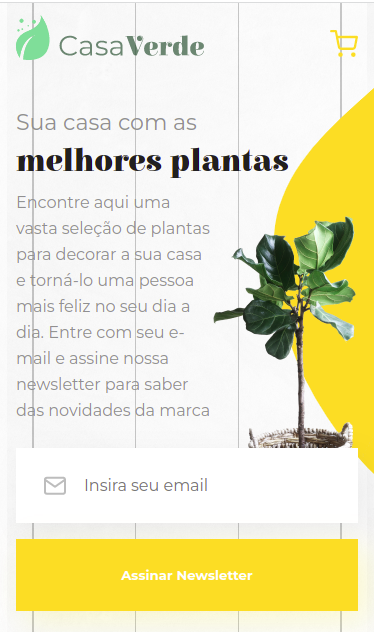

 
      

### Tópicos

* Descrição do projeto
* Status do projeto
* Linguagens utilizadas 
* Acesso ao projeto
* Autora

## Descrição do projeto
O projeto Casa Verde foi desenvolvido a partir de um protótipo figma [que pode ser feito download](https://github.com/nalutm/casa-verde/raw/main/styleguides.fig) e importado no figma disponibilizado em um dos [cursos da escola front-end da Alura](https://www.alura.com.br/escola-front-end). 
Dessa forma, pude primeiro fazer o meu código e em seguida revisá-lo assistindo as aulas do curso e reparando onde poderia melhorar.

A partir desse projeto treinei: 
* conceito Mobile First;
* identificar componentes de um projeto e criá-los no CSS;
* sobreposição de imagens;
* organização de arquivos e pastas seguindo boas práticas;
* como utilizar a extensão EMMET e HTML CSS Support;

Como desafio irei continuar os layouts das demais páginas e da versão desktop.

 
      

## Status do Projeto
Em andamento

## Linguagens Utilizadas
* HTML;
* CSS

## Acesso ao projeto
Você pode acessar o [código fonte do projeto](https://github.com/nalutm/casa-verde) ou [baixá-lo](https://github.com/nalutm/casa-verde/archive/refs/heads/main.zip). Também pode acessar a [página para conferir o resultado final](https://casa-verde-pearl.vercel.app/)

## Autora
[Nayara Luiza Tavares Moraes](https://github.com/nalutm)

